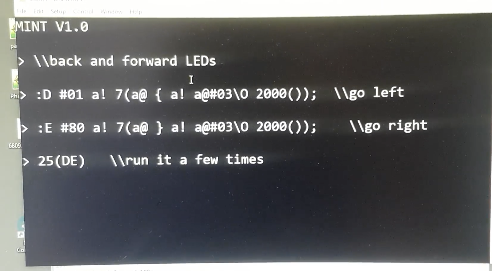

# Introducing MINT - a programming language for the TEC-1

As most of you know the TEC-1 was designed by Ken Stone and myself over the summer of 1982-83 and published in the February 1983 issue of Talking Electronics magazine. This design was the culmination of a few years of experimentation which began in the late 1970s and passed through a prototype stage (the "Onion" computer). It was strongly influenced by the computers of the time, computer training boards such as the Microprofessor and of course the then dominant Sinclair range of entry level computers.

The published TEC-1 kit was the entry point into digital hardware and computing for a large number of people. Many people attribute the TEC-1 as having influenced the trajectory of their careers. This is very gratifying. Personally, the TEC-1 was where I first cut my teeth as a software engineer and I am personally happy that people still remember this little computer and continue to tinker with it.

That said, the TEC-1 was never an easy machine to program unlike other machines such as its contemporary, the ZX81, which came with a easy to use BASIC programming language ROM. Interpreted BASIC for all its faults enabled people to code reasonably simply and to even control hardware. It was never fast though, in fact it's very slow when compared to native code. It always seemed odd to me that there was no in between, you either programmed in machine code and used the full speed of the CPU or you programmed in BASIC and lost two orders of magnitude in performance but gained a little bit of a higher level perspective. There have always been lesser known alternatives such as Chuck Moore's Forth programming language and I've wondered for a long time whether Forth would be a viable programming language on the TEC-1. Over the past two years I've thrown myself into and developed a reasonable level of expertise in Forth.

For the last 4 months I've be collaborating with Ken Boak and Craig Jones to bring a minimalist programming language called "MINT" to the TEC-1. MINT is not a pure Forth but is modeled very closely on Forth. Even a minimal Forth has a minimal kernel of around 5K on the Z80 but the basic configuration of the TEC-1 comes with a 2K ROM, just enough for a monitor program. What else can be done in such a small space?

Ken Boak wrote the initial version of MINT back in July this year and then I got involved and have worked closely with him to add many of the Forth capabilities that I thought that the first version of MINT lacked. Craig Jones wrote the serial drivers which work with both bit-banged and 6850 driven hardware. He also added code to allow users to load Intel hex files into the TEC-1 to extend Mint's capabilities.

I think that MINT is a nice compromise between writing machine code and using BASIC. It's interpreted like BASIC but it uses a much more efficient byte code virtual machine which allows MINT run at a decent speed. We still need to write detailed benchmarks to make a fair comparison but my current feeling is that MINT is an order of magnitude slower than machine code and an order of magnitude faster than BASIC. It is interactive in a similar to BASIC or Python but quite a bit faster than both. It also runs in considerably less memory and I think it's ideal for prototyping, exercising hardware, controlling ports. It would be excellent for "bringing up" new hardware and we currently looking around at other CPUs and computing systems to port to.

We are launching MINT first for the TEC-1 as an exclusive first look. Our goal has been to release MINT before Christmas and we've just met that goal. Expect more posts on MINT in the coming weeks. Posts on how to get it running on your TEC-1, how to program in MINT ands also because the [TEC-1 Z80 Computer Group](https://www.facebook.com/groups/tec1z80) is all about developing a low level understanding of how things work, a series of posts on the internals of MINT and how it does what it does.

The MINT repo with the TEC-1 ROM and other builds can be found with the [tec1group](https://github.com/tec1group/MINT) repos on GitHub.
The documentation, which is still a work in progress, can be found [here](https://github.com/tec1group/MINT-Documentation)

Below you can see a video of Craig Jones running a MINT program on the TEC-1F

